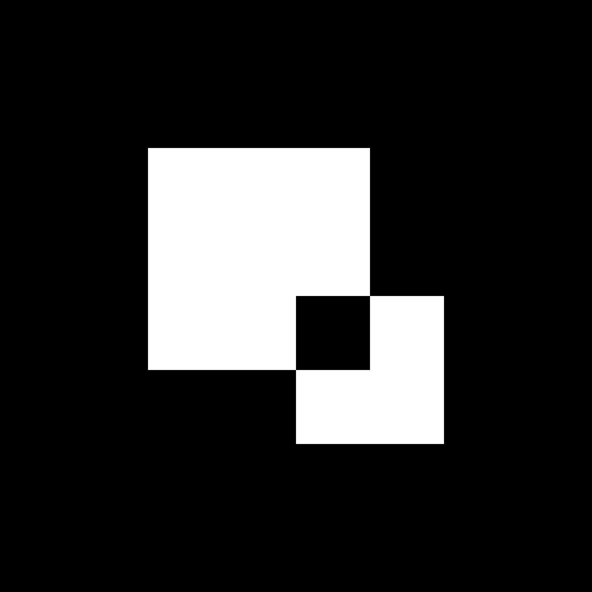

#  anotherblock platform contracts

## install foundry

[foundry installation procedure](https://book.getfoundry.sh/getting-started/installation)

## setup environment

create `.env` file in the root directory as per `.env.example`

```sh
cp .env.example .env
```

source the `.env` file (from the root directory):

```sh
source .env
```

## compile contracts

```sh
forge build
```

## test contracts

execute full test campaign :

```sh
forge test -vvv
```

analyze test coverage :

```sh
forge coverage
```

## deploy contracts

### optimism goerli :

deploy and verify ABSuperToken (superfluid mock token) :

```sh
forge script script/op/deploy-ABSuperToken.s.sol:DeployMockSuperToken --rpc-url optimism-goerli --broadcast --verify --etherscan-api-key ${OPTIMISM_ETHERSCAN_API_KEY}
```

simulate deployment :

```sh
    forge script script/op/deploy-platform.s.sol:DeployPlatform --rpc-url optimism-goerli
```

deploy and verify anotherblock platform contracts :

```sh
    forge script script/op/deploy-platform.s.sol:DeployPlatform --rpc-url optimism-goerli --broadcast --verify --etherscan-api-key ${OPTIMISM_ETHERSCAN_API_KEY}
```

### base goerli :

simulate deployment :

```sh
    forge script script/base/deploy-platform.s.sol:DeployPlatform --rpc-url base-goerli
```

deploy and verify anotherblock platform contracts :

```sh
    forge script script/base/deploy-platform.s.sol:DeployPlatform --rpc-url base-goerli --broadcast --verify
```
